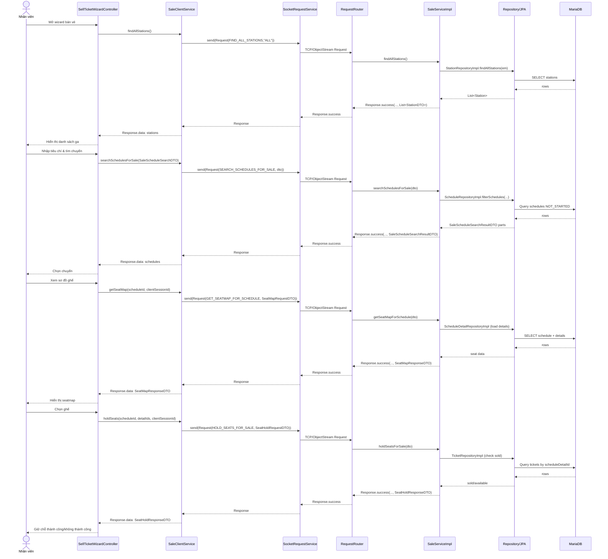
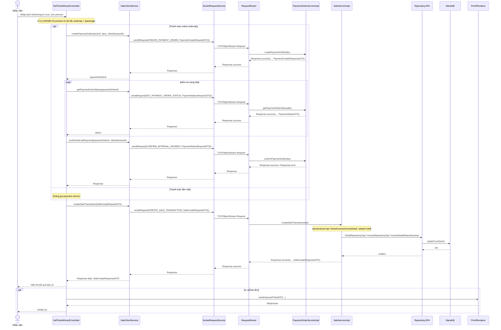

# Diagrams: UC001 Bán vé

> Source use case: `docs/usecases/uc001-ban-ve.md`  
> Distributed Java system — JavaFX Client/Server over TCP Socket

## Activity Diagram

```mermaid
flowchart TD
    Start([Start]) --> A1[Tải danh sách ga]
    A1 --> A2[Nhập tiêu chí: ga đi/đến, ngày, loại vé]
    A2 --> D1{Có lịch trình phù hợp?}
    D1 -- Không --> E1[Thông báo không có chuyến] --> End([End])
    D1 -- Có --> A3[Chọn chuyến đi (và chuyến về nếu khứ hồi)]

    subgraph SEAT["Chọn ghế & giữ chỗ"]
        A3 --> A4[Xem sơ đồ ghế]
        A4 --> A5[Chọn ghế]
        A5 --> A6[Hold ghế theo clientSessionId]
        A6 --> D2{Hold đủ ghế?}
        D2 -- Không --> E2[Thông báo ghế đã giữ/bán] --> A5
        D2 -- Có --> A7[Tiếp tục]
    end

    A7 --> A8[Nhập người mua & hành khách]
    A8 --> D3{Dữ liệu hợp lệ?}
    D3 -- Không --> E3[Hiển thị lỗi nhập liệu] --> A8
    D3 -- Có --> A9[Preview / tính giá]

    A9 --> D4{Phương thức thanh toán?}
    D4 -- Tiền mặt --> A10[Xác nhận thanh toán]
    D4 -- Online --> A11[Tạo payment order]
    A11 --> A12[Kiểm tra trạng thái / xác nhận thanh toán]
    A12 --> D5{Thanh toán OK?}
    D5 -- Không --> E4[Thông báo lỗi thanh toán] --> D6{Hủy giao dịch?}
    D6 -- Có --> A13[Release hold ghế] --> End
    D6 -- Không --> A11
    D5 -- Có --> A10

    A10 --> A14[Tạo Ticket + Invoice + InvoiceDetail]
    A14 --> A15[Release hold ghế]
    A15 --> D7{In vé/hóa đơn?}
    D7 -- Có --> A16[Render/Print vé & hóa đơn]
    D7 -- Không --> A17[Hoàn tất]
    A16 --> End
    A17 --> End
```

## Sequence Diagram





## Notes

- `SellTicketWizardController` hiện không set `SaleCreateRequestDTO.employeeId`; server có thể lưu `Invoice.employee` là `null` trong UC001.
- Không có uncertainty đáng kể khác
