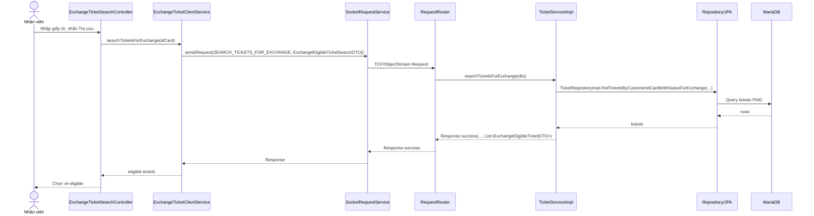
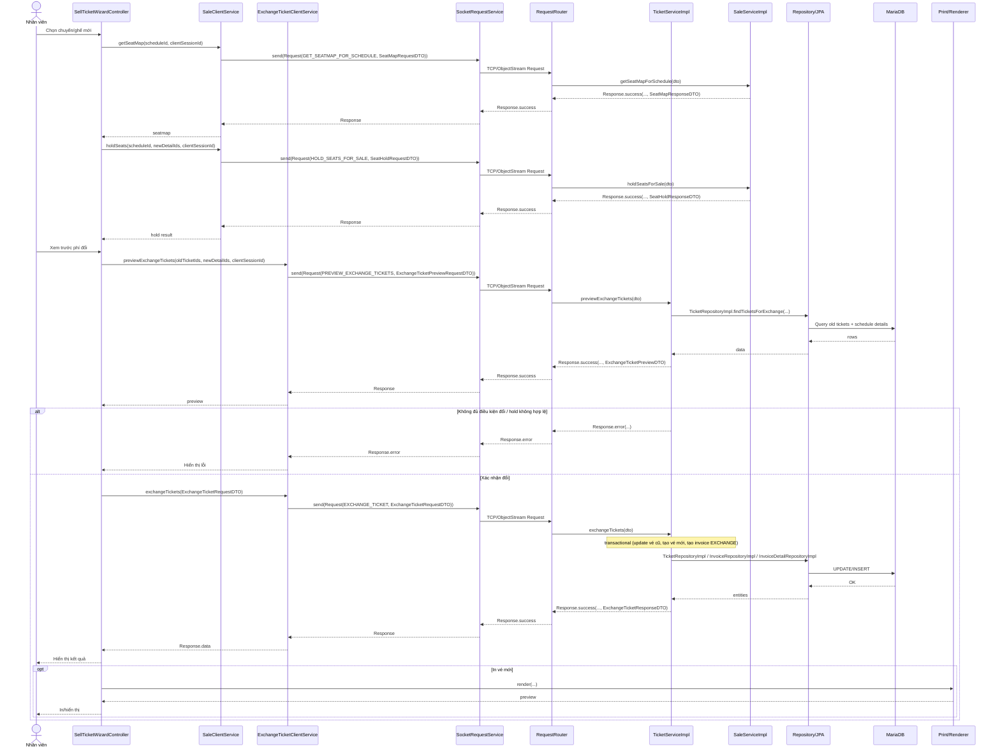

# Diagrams: UC002 Đổi vé

> Source use case: `docs/usecases/uc002-doi-ve.md`  
> Distributed Java system — JavaFX Client/Server over TCP Socket

## Activity Diagram

```mermaid
flowchart TD
    Start([Start]) --> A1[Nhập CCCD/Hộ chiếu để tra cứu vé]
    A1 --> A2[Tải danh sách vé đủ điều kiện đổi]
    A2 --> D1{Có vé eligible?}
    D1 -- Không --> E1[Thông báo không có vé đủ điều kiện] --> End([End])
    D1 -- Có --> A3[Chọn vé cần đổi]

    A3 --> A4[Mở wizard chọn ghế mới (exchange mode)]
    A4 --> A5[Chọn chuyến mới & xem seatmap]
    A5 --> A6[Chọn ghế mới & hold ghế]
    A6 --> D2{Hold đủ ghế?}
    D2 -- Không --> E2[Ghế mới không còn/đang giữ] --> A5
    D2 -- Có --> A7[Xem trước phí đổi/chênh lệch]
    A7 --> D3{Đủ điều kiện đổi?}
    D3 -- Không --> E3[Thông báo lý do không đủ điều kiện] --> A8[Release hold] --> End
    D3 -- Có --> A9[Xác nhận đổi vé]
    A9 --> A10[Cập nhật vé cũ EXCHANGED + tạo vé mới PAID]
    A10 --> A11[Tạo Invoice EXCHANGE]
    A11 --> D4{In vé mới?}
    D4 -- Có --> A12[Render/Print vé mới] --> End
    D4 -- Không --> End
```

## Sequence Diagram





## Notes
- Luồng kiểm tra “giữ nguyên ga đi/ga đến” không thấy thể hiện rõ ở server; nếu có yêu cầu nghiệp vụ này thì hiện đang thiếu/partial theo usecase doc.
- In vé sau đổi có thể partial do `SellTicketWizardController` không gán dữ liệu in từ `ExchangeTicketResponseDTO` (theo usecase doc).

