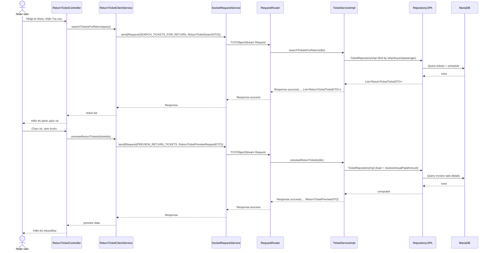
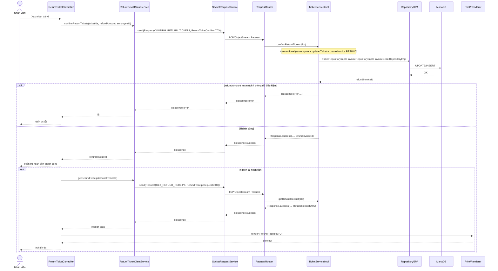

# Diagrams: UC003 Trả vé

> Source use case: `docs/usecases/uc003-tra-ve.md`  
> Distributed Java system — JavaFX Client/Server over TCP Socket

## Activity Diagram

```mermaid
flowchart TD
    Start([Start]) --> A1[Nhập từ khóa (tùy chọn) để tra cứu vé PAID]
    A1 --> A2[Hiển thị danh sách vé có thể trả]
    A2 --> D1{Có vé PAID?}
    D1 -- Không --> E1[Thông báo không có vé phù hợp] --> End([End])
    D1 -- Có --> A3[Chọn 1..n vé để trả]

    A3 --> A4[Xem trước tiền hoàn]
    A4 --> D2{Đủ điều kiện trả?}
    D2 -- Không --> E2[Thông báo: dưới 4h/đã trả/khác khách hàng] --> End
    D2 -- Có --> A5[Xác nhận trả vé]
    A5 --> D3{Số tiền khớp tính toán server?}
    D3 -- Không --> E3[Lỗi mismatch số tiền] --> A4
    D3 -- Có --> A6[Cập nhật Ticket RETURNED + QR INVALID]
    A6 --> A7[Tạo Invoice REFUND + InvoiceDetail]
    A7 --> D4{In biên lai?}
    D4 -- Có --> A8[Lấy dữ liệu biên lai & in] --> A9[Reload danh sách vé PAID]
    D4 -- Không --> A9[Reload danh sách vé PAID]
    A9 --> End
```

## Sequence Diagram





## Notes
- `GET_REFUND_RECEIPT` trên server có thể chỉ lấy detail đầu tiên của invoice REFUND; nếu trả nhiều vé trong một giao dịch thì biên lai có thể partial.
- Không thấy logic hoàn/điều chỉnh `Customer.rewardPoints` khi trả vé trong `TicketServiceImpl` (theo usecase doc).

