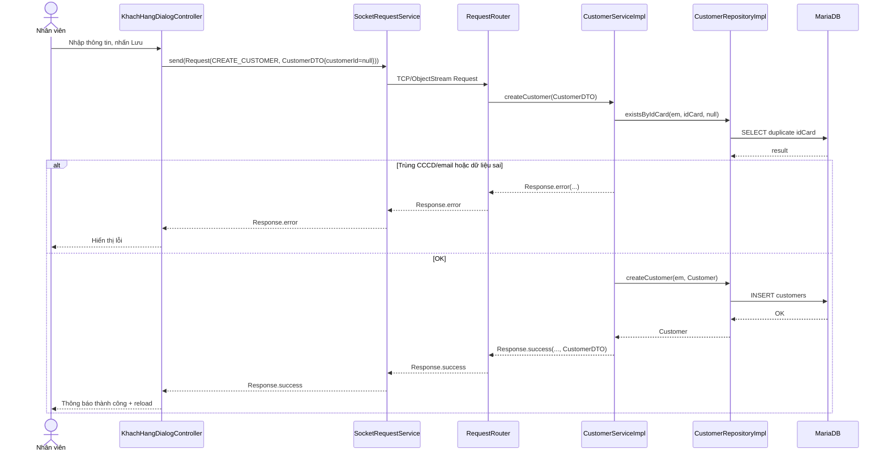

# Diagrams: UC004A Thêm khách hàng

> Source use case: `docs/usecases/uc004a-them-khach-hang.md`  
> Distributed Java system — JavaFX Client/Server over TCP Socket

## Activity Diagram

```mermaid
flowchart TD
    Start([Start]) --> A1[Mở dialog thêm khách hàng]
    A1 --> A2[Nhập họ tên + CCCD hoặc hộ chiếu + (SĐT/email tùy chọn)]
    A2 --> D1{Validate client OK?}
    D1 -- Không --> E1[Hiển thị lỗi nhập liệu] --> A2
    D1 -- Có --> A3[Gửi tạo khách hàng]
    A3 --> D2{Server validate OK?}
    D2 -- Không --> E2[Hiển thị lỗi dữ liệu/duplicate] --> A2
    D2 -- Có --> A4[Lưu Customer isActive=true]
    A4 --> A5[Đóng dialog & reload danh sách]
    A5 --> End([End])
```

## Sequence Diagram



## Notes
- Không có uncertainty đáng kể

