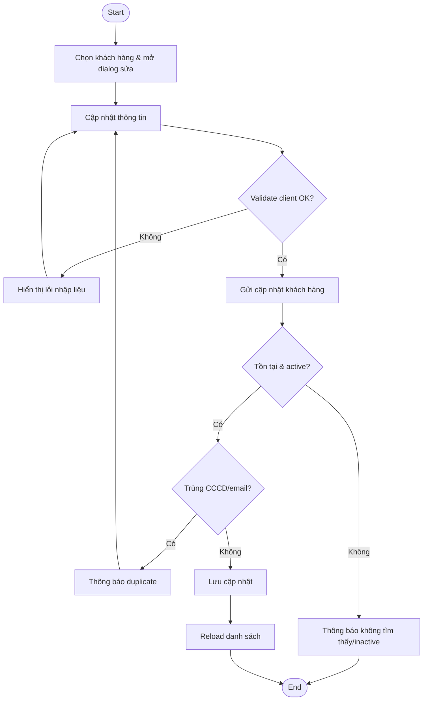
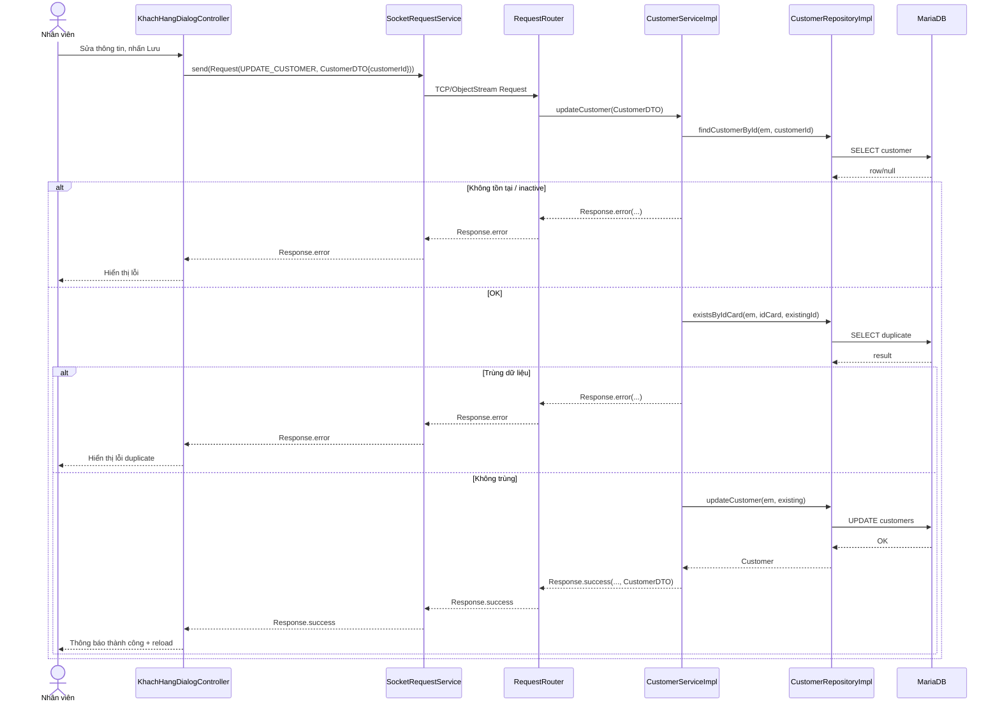

# Diagrams: UC004B Cập nhật khách hàng

> Source use case: `docs/usecases/uc004b-cap-nhat-khach-hang.md`  
> Distributed Java system — JavaFX Client/Server over TCP Socket

## Activity Diagram

## Sequence Diagram

## Notes
- Theo usecase doc: `CustomerServiceImpl.updateCustomer` không thấy set `passport` (có thể partial nếu cần cập nhật hộ chiếu).
- Không có uncertainty đáng kể khác

