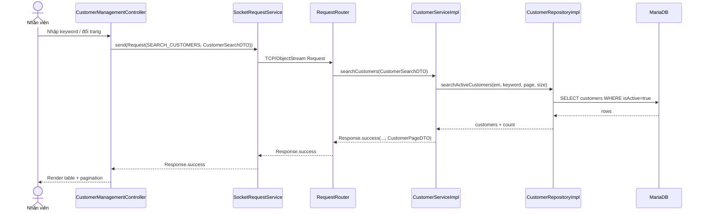

# Diagrams: UC004C Tra cứu khách hàng

> Source use case: `docs/usecases/uc004c-tra-cuu-khach-hang.md`  
> Distributed Java system — JavaFX Client/Server over TCP Socket

## Activity Diagram

```mermaid
flowchart TD
    Start([Start]) --> A1[Nhập keyword (tùy chọn) & chọn trang]
    A1 --> A2[Gửi tra cứu khách hàng active]
    A2 --> D1{Query thành công?}
    D1 -- Không --> E1[Hiển thị lỗi tìm kiếm] --> End([End])
    D1 -- Có --> A3[Hiển thị danh sách + phân trang]
    A3 --> End
```

## Sequence Diagram



## Notes
- UC004 tra cứu hiện chỉ search active customers; nếu cần tra cứu cả `isActive=false` thì hiện đang thiếu/partial theo usecase doc.

