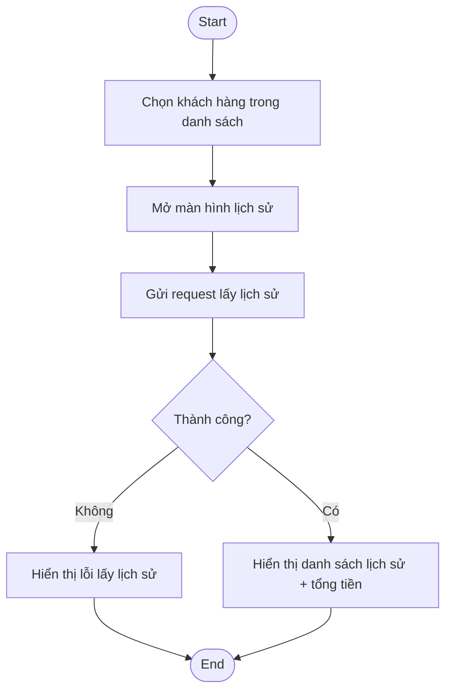
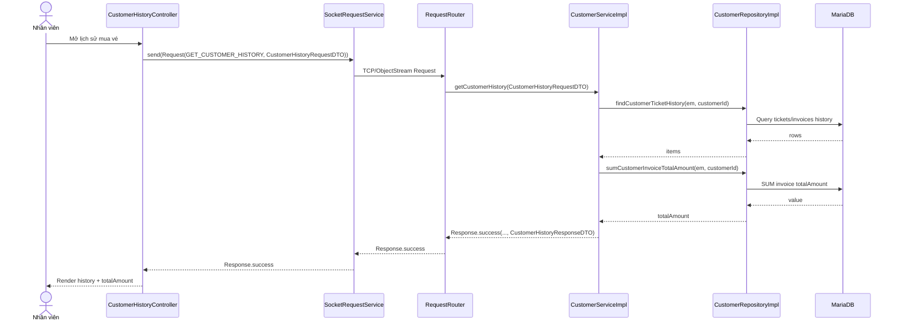

# Diagrams: UC004D Xem lịch sử khách hàng

> Source use case: `docs/usecases/uc004d-xem-lich-su-khach-hang.md`  
> Distributed Java system — JavaFX Client/Server over TCP Socket

## Activity Diagram

## Sequence Diagram

## Notes
- Message success/error của `CustomerServiceImpl.getCustomerHistory` đang hard-code (không theo `CustomerMessages.*`), nên trace chuỗi message cần bám theo code hiện tại.

