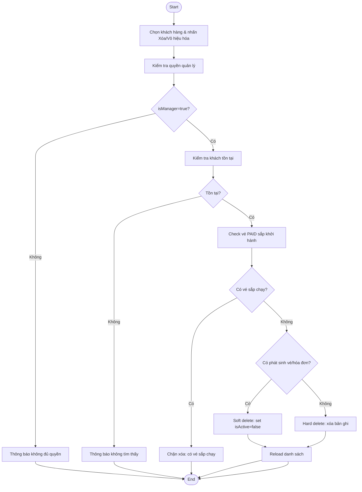
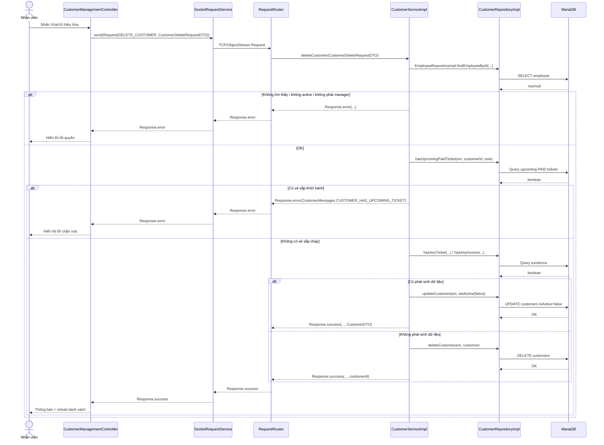

# Diagrams: UC004E Xóa mềm khách hàng

> Source use case: `docs/usecases/uc004e-xoa-mem-khach-hang.md`  
> Distributed Java system — JavaFX Client/Server over TCP Socket

## Activity Diagram

## Sequence Diagram

## Notes
- Server có nhánh hard delete khi khách chưa phát sinh vé/hóa đơn; nếu nghiệp vụ yêu cầu luôn soft delete thì hiện tại khác (different) theo usecase doc.

